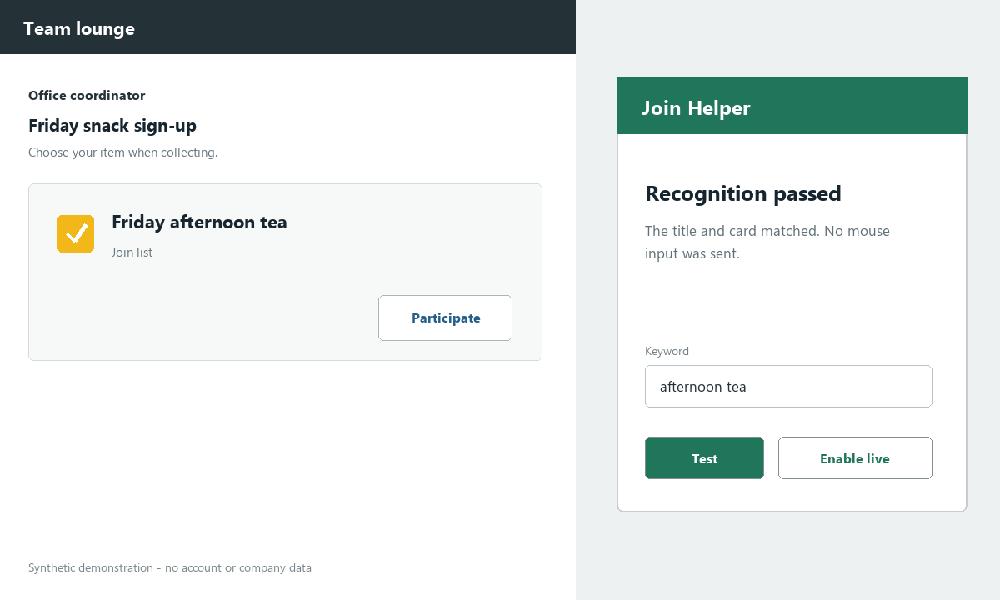
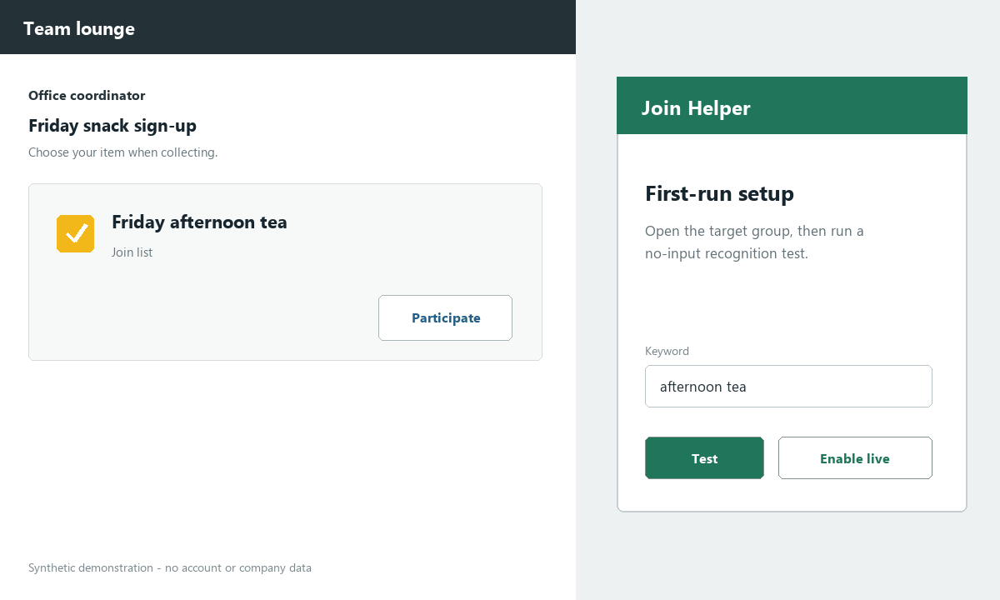

# WeCom Join Helper

An unofficial Windows desktop helper that recognizes a user-selected WeCom
group sign-up card, inserts the current WeCom identity once, and stops.

> This project is unofficial and is not affiliated with, endorsed by, or
> supported by WeCom or Tencent.



## Features

- Chinese OCR title filtering with a configurable keyword.
- Multi-scale visual matching for common window sizes and high-DPI displays.
- A group-header guard that stops when the visible conversation changes.
- A no-input recognition test before live mode can be enabled.
- One insertion attempt per launch, with no retry after the attempt starts.
- Installer and portable Windows builds with SHA-256 checksums.
- Local settings and redacted rotating logs; no cloud service is involved.

## Safety Boundary

Join Helper automates visible desktop controls for an already logged-in user.
It does not log in, read passwords, handle QR or verification prompts, call
private WeCom APIs, disable security controls, or run as a background service.

Use it only where you are authorized and where your organization's policies
allow desktop automation. A UI change can break visual automation, so every
ambiguous or unexpected state fails closed without another click.

## Installation

Open this repository's [Releases](../../releases) page and choose one artifact:

- `JoinHelper-Setup-vX.Y.Z.exe`: standard per-user installer with optional
  desktop shortcut and a normal uninstall entry.
- `JoinHelper-Portable-vX.Y.Z.zip`: extract the folder and run
  `JoinHelper.exe`; settings stay in its `data` directory.

Windows may show an unknown-publisher warning because early releases are not
code-signed. Verify the adjacent `.sha256` file before running a download. Do
not disable Windows security features to install the application.

## Quick Start

1. Sign in to WeCom and open the intended group.
2. Start Join Helper and set a stable keyword from the card title, such as
   `下午茶`.
3. Keep the target group visible and choose **Test Recognition**. This mode
   sends no mouse input.
4. After the test passes, enable live mode.
5. On later launches, open the target group first and then start Join Helper.

The application exits after success, timeout, a duplicate card, or an unsafe
UI state. It does not continue scanning after an insertion attempt.



## How It Works

The detector pairs a generic yellow sign-up icon with its adjacent participation
button at several scales. RapidOCR reads only the nearby title crop. A candidate
must satisfy both visual checks and contain the configured normalized keyword.
The runner then uses a fail-closed one-attempt state machine for the document
insertion and commit flow.

See [Architecture](docs/architecture.md) for the component and state diagrams.

## Limitations

- Windows desktop only.
- The user must open and keep the intended group visible.
- Visual templates can require updates after a WeCom UI redesign.
- Similar matching cards visible at the same time can be ambiguous.
- Compatibility is limited to configurations listed in
  [Compatibility](docs/compatibility.md).
- Real WeCom interaction cannot be exercised in public CI.

## Development

```powershell
py -3.12 -m venv .venv
.venv\Scripts\python.exe -m pip install -r requirements.txt -r requirements-dev.txt
.venv\Scripts\python.exe -m unittest discover -s tests -v
```

Build a portable beta from PowerShell:

```powershell
./scripts/build_release.ps1 -Version 0.9.0 -PythonExe .venv\Scripts\python.exe -SkipBootstrap
```

The frozen smoke test loads all four templates, OpenCV matching, RapidOCR,
ONNX Runtime, and the three bundled OCR models against a synthetic fixture. It
never discovers or clicks a real WeCom window.

See [Contributing](CONTRIBUTING.md), [Security](SECURITY.md), and
[Troubleshooting](docs/troubleshooting.md) before opening an issue.

## 中文快速开始

这是一个非官方 Windows 企业微信接龙辅助工具，并非企业微信或腾讯官方产品。

1. 登录企业微信并打开目标群。
2. 启动“接龙助手”，设置标题关键词，例如“下午茶”。
3. 首次使用先点“测试识别”；测试模式不会发送鼠标点击。
4. 识别成功后启用正式模式。
5. 正式模式只尝试接龙一次，成功或异常后立即停止，不会重复点击。

请仅在获得授权并符合所在组织规定的情况下使用。程序不会处理登录、二维码、
验证码或安全验证窗口。

## License

[MIT](LICENSE)
