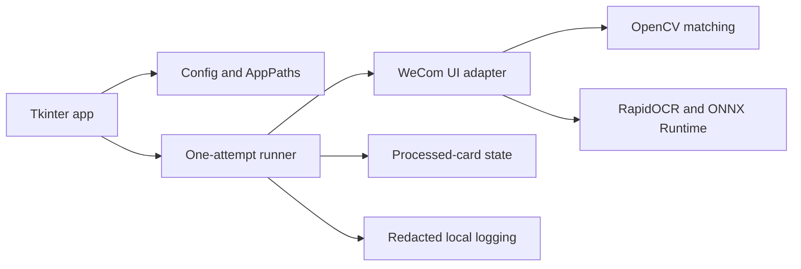
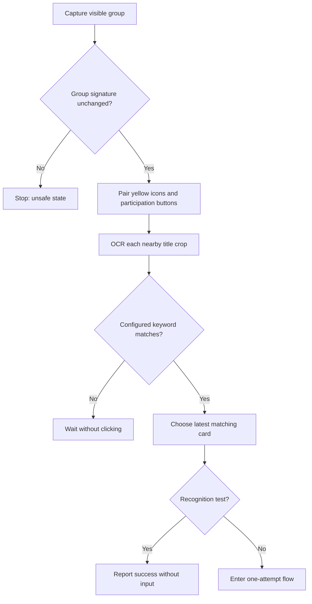
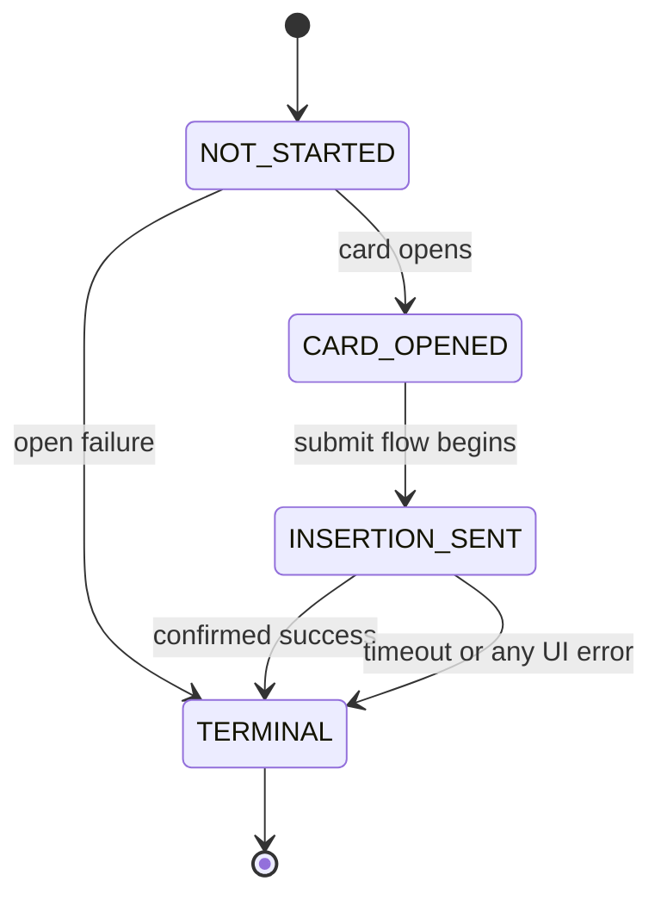

# Architecture

## Runtime Components

`app` owns the Tk event loop and runs monitoring on one worker thread. Widget
updates return through a queue; the worker never writes Tk state directly.

`paths` separates immutable application files from mutable user data. Installed
builds use `%LOCALAPPDATA%\WeComJoinHelper`; portable builds use `data` beside
the executable. Templates remain read-only application assets.

`ui` discovers visible WeCom windows, captures bounded screenshots, pairs card
elements, verifies the group-header signature, and executes the document flow.
It raises `UIError` whenever the expected state is missing or ambiguous.

`vision` performs scale-independent template matching and compact image
signatures. `ocr` initializes RapidOCR lazily and normalizes punctuation and
spacing before keyword comparison.

## Candidate Data Flow

## One-Attempt State Machine

The runner conservatively enters `INSERTION_SENT` before asking the UI adapter
to click the document insertion control. Therefore an exception anywhere in
that call is terminal, even when the application cannot prove whether WeCom
received the click. This intentionally prefers stopping over a duplicate row.

## Packaging

PyInstaller produces a windowed `onedir` bundle. The spec collects only the
three RapidOCR models required at runtime and relies on maintained package hooks
for native DLLs. A frozen smoke entry loads templates, OpenCV, OCR, ONNX Runtime,
and synthetic assets without opening WeCom. Inno Setup wraps the same bundle in
a per-user installer. GitHub Actions repeats tests and both smoke paths for tags.
